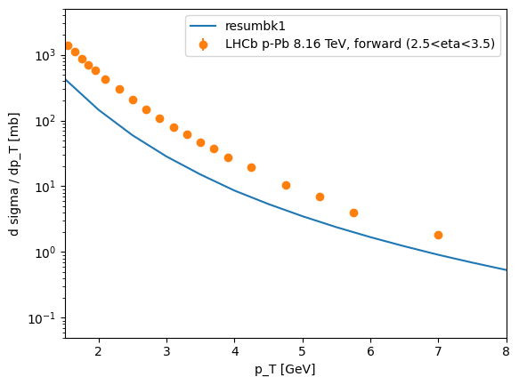
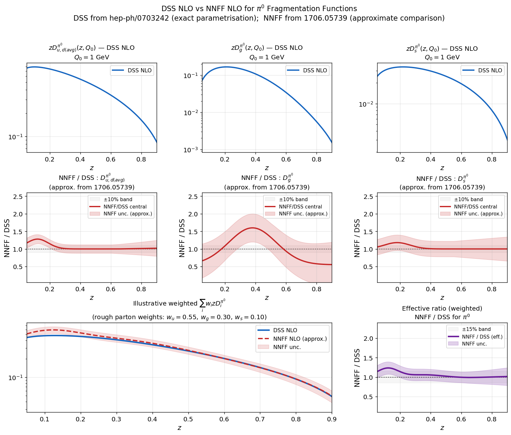

# Reproducing old results

Original paper https://inspirehep.net/literature/2708699
H. Mäntysaari, Y. Tawabutr, e-Print: 2310.06640 [hep-ph], Phys.Rev.D 109 (2024) 3, 034018

## BK dipoles

Dipole amplitudes from [arXiv:2007.01645](https://arxiv.org/pdf/2007.01645) for the dipole-proton scattering are available [in github](https://github.com/hejajama/nlodisfit/tree/master/data). However, the file format has changed after the publication of that dataset, so:

* Note: this code uses a slightly different format: instead of the initial rapidity (line `### Y0`), it assumes that in the datafile user specifices $x_0 = e^{-Y_0}$. 
* In the original paper only dipoles with $Y_0=4.61$ were used, so the user has to change `###4.60517` to `###0.01`
* When evaluating the dipole at the initail condition, this code uses an anlaytical parametrization. Parameters are read from the datafile, but files in the above mentioned repository do not contain that information. To add the information, the user has to add the following line to the beginning of the file:
`# Initial condition: MV model, Q_s0^2 = 0.0964 GeV^2, \gamma = 0.98, coefficient of E inside Log is 1, x0=0.01, \Lambda_QCD = 0.241 GeV`
where numbers should match the actual fit (Tables I and II in [arXiv:2007.01645](https://arxiv.org/pdf/2007.01645) )

This complication is because the code uses now the data format used in more recent NLO fits, see [Casuga's Github repository](https://github.com/camcasuga/bayesian_alldata)

BK solution files in the `bksolutions` directory have been adapted to this format.

### Manually generating dipole amplitudes

* The NLOBK code is available [on github](https://github.com/hejajama/nlobk)
* ResumBK is run by using `-order lo_resum_dlog_slog` (resums double and single logs). Example command to run to reproduce ResumBK fit 1, i.e. first line on Table II of [arXiv:2007.01645](https://arxiv.org/pdf/2007.01645)
```bash
 ./build/bin/nlobk -ic PARAM 0.0964 0.98 0 -maxy 10 -order lo_resum_dlog_slog -nf 3 -alphas_scaling 1.21 -rc parent -resumrc parent -output dipoledatafile.dat
```

## Computing the $\pi^0$ production cross section

In order to compute $p+p \to \pi^0 + X$ using the `ResumBK` fit obtained using the parent dipole running coupling (first line on Table II of [arXiv:2007.01645](https://arxiv.org/pdf/2007.01645)), run
```bash
python3 utils/runner.py --pt-min 1 --pt-max 8 --pt-step 0.5 --col pp --rc mom --muratio 4 --y 3 --sqrts 8160 --threads 1 --max-runners 10 --output resumbk1spectra_fit_1 --bk-proton bksolutions/Resumbk_fit_1/dipole-resumbk-hera-parent-4.61.dip --bk-nucleus bksolutions/Resumbk_fit_1/dipole-resumbk-hera-parent-4.61.dip --pi0 --sigma02 19.67088
````
Note that $16.6708$ is $7.66 \mathrm{mb}$ from Table II of [arXiv:2007.01645](https://arxiv.org/pdf/2007.01645) converted to  $\mathrm{GeV}^{-2}$ 
* This particular example uses 10 threads to compute different pt's and channels simultaneously

The computed cross section multiplied by $A=208$ should be close to the p+A curve in the original paper (Fig. 2). At the moment there is some mismatch, we get a somewhat smaller normalization as illustrated in the figure below



### Note on fragmentation functions

Examples in this document are computed using the new default choice for the fragmentation function which is NNFF1.0. The original publication used NLO DSS fragmentation function, but that is not available in LHAPDF which is used in the current/modernized version of the code.

The plot below is Claude's estimate for the difference at the initial scale. Some max 50% effects are possible in the $g\to \pi^0$ channel.


